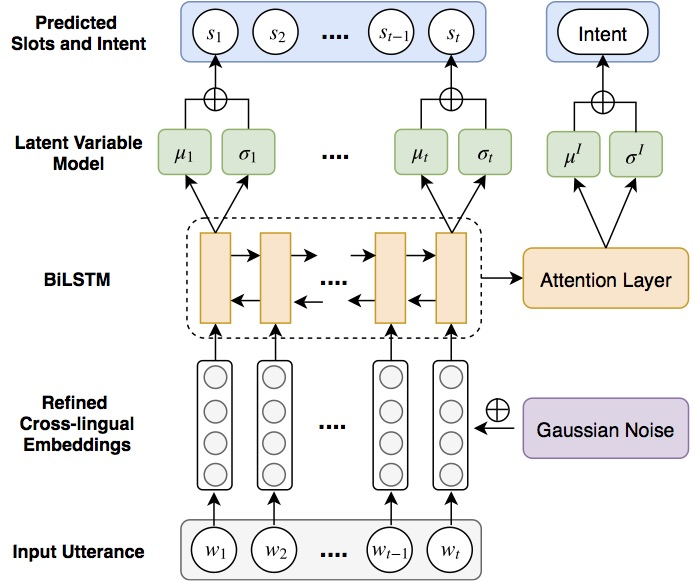

# Zero-shot Cross-lingual Task-Oriented Dialogue System

 [](https://opensource.org/licenses/MIT)


This repository is for the paper accepted in EMNLP 2019: [Zero-shot Cross-lingual Dialogue Systems with Transferable Latent Variables](https://www.aclweb.org/anthology/D19-1129.pdf)

This code has been written using PyTorch. If you use any source codes or ideas included in this toolkit in your work, please cite the following papers.
<pre>
@inproceedings{liu2019zero,
  title={Zero-shot Cross-lingual Dialogue Systems with Transferable Latent Variables},
  author={Liu, Zihan and Shin, Jamin and Xu, Yan and Winata, Genta Indra and Xu, Peng and Madotto, Andrea and Fung, Pascale},
  booktitle={Proceedings of the 2019 Conference on Empirical Methods in Natural Language Processing and the 9th International Joint Conference on Natural Language Processing (EMNLP-IJCNLP)},
  pages={1297--1303},
  year={2019}
}
</pre>

## Abstract
Despite the surging demands for multilingual task-oriented dialog systems (e.g., Alexa, Google Home), there has been less research done in multilingual or cross-lingual scenarios. Hence, we propose a zero-shot adaptation of task-oriented dialogue system to low-resource languages. To tackle this challenge, we first use a set of very few parallel word pairs to refine the aligned cross-lingual word-level representations. We then employ a latent variable model to cope with the variance of similar sentences across different languages, which is induced by imperfect cross-lingual alignments and inherent differences in languages. Finally, the experimental results show that even though we utilize much less external resources, our model achieves better adaptation performance for natural language understanding task (i.e., the intent detection and slot filling) compared to the current state-of-the-art model in the zero-shot scenario.

## Data
We evaluate our system on multilingual task-oriented dialogue dataset Published by [Schuster et al. (2019)](https://www.aclweb.org/anthology/N19-1380.pdf), which contains Dialog Natural Language Understanding data in English, Spanish and Thai. We put this dataset in the data folder under this repository.

## Model Architecture


## Setup
- Install PyTorch (Tested in PyTorch 0.4.0 and Python 3.6)
- Install library dependencies
- Download cross-lingual word embeddings in English, Spanish and Thai from [fasttext](https://fasttext.cc/docs/en/aligned-vectors.html), and put it in the emb folder.

Note: Refined cross-lingual word embeddings are already included in the refine_emb folder, where "refine.en.align.en-es.vec" and "refine.es.align.vec" are refined pairs for adapting to Spanish, and "refine.en.align.en-th.vec" and "refine.th.align.vec" are for adapting to Thai.

## Cross-lingual NLU

* ```--embnoise```: inject Gaussian noise into English embeddings
* ```--lvm``` : use latent variable model
* ```--crf``` : use conditional random field
* ```--emb_file_en```: path of English embeddings (choose to use refined cross-lingual embeddings, the default setting is the original cross-lingual embeddings from fasttext)
* ```--emb_file_es```: path of Spanish embeddings
* ```--emb_file_th```: path of Thai embeddings
* ```--clean_txt```: conduct delexicalization

### Training
Train English system for Spanish Adaptation
```
python main.py --exp_name lvm_refine_noise_clean_enes --exp_id 1 --bidirection --freeze_emb --lvm --lvm_dim 100 --batch_size 32 --emb_file_en ./refine_emb/refine.en.align.en-es.vec --embnoise --clean_txt --early_stop 1
```
Train English system for Thai Adaptation
```
python main.py --exp_name lvm_refine_noise_clean_enth --exp_id 2 --bidirection --freeze_emb --lvm --lvm_dim 100 --batch_size 32 --emb_file_en ./refine_emb/refine.en.align.en-th.vec --embnoise --clean_txt --early_stop 1
```

### Zero-shot Adaptation
Zero-shot transfer to Spanish
```
python main.py --exp_name lvm_refine_noise_clean_enes --exp_id 1 --transfer --trans_lang es --bidirection --lvm --emb_file_es ./refine_emb/refine.es.align.vec --clean_txt
```
Zero-shot transfer to Thai
```
python main.py --exp_name lvm_refine_noise_clean_enth --exp_id 1 --transfer --trans_lang th --bidirection --lvm --emb_file_th ./refine_emb/refine.th.align.vec --clean_txt
```

## Reproducibility
We provide the pretrained checkpoints of our model in the experiment folder to help you reproduce the results in Spanish and Thai by running the following commands:

Zero-shot transfer to Spanish
```
python main.py --exp_name lvm_refine_noise_clean_enes --exp_id best --transfer --trans_lang es --bidirection --lvm --emb_file_es ./refine_emb/refine.es.align.vec --clean_txt
```
Zero-shot transfer to Thai
```
python main.py --exp_name lvm_refine_noise_clean_enth --exp_id best --transfer --trans_lang th --bidirection --lvm --emb_file_th ./refine_emb/refine.th.align.vec --clean_txt
```
